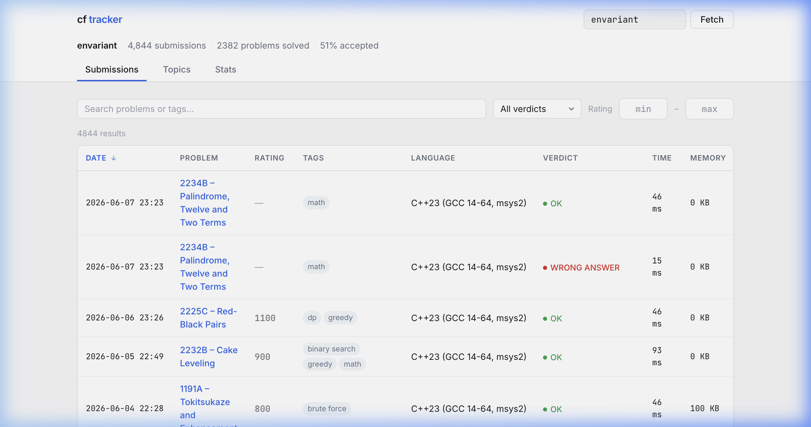
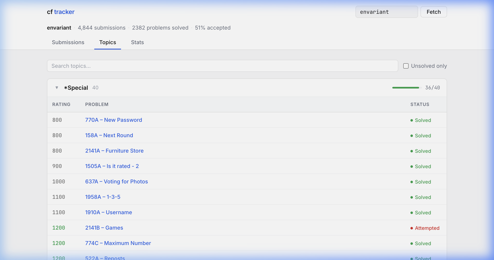
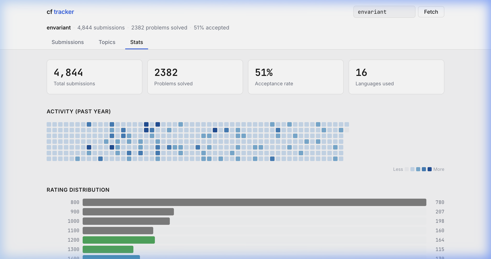

# CF Tracker

A minimal, single-page web app to track Codeforces submissions, explore problems by topic, and visualize competitive programming stats — all from any user handle.



## Why I Built This

I wanted a cleaner way to review my Codeforces progress without the clutter of the default profile page. The goal was a fast, focused tool that answers three questions at a glance:

1. **What have I submitted recently?** → Submissions tab with search, filters, and sorting
2. **Where am I strong/weak by topic?** → Topics tab with progress bars per category
3. **What does my overall profile look like?** → Stats tab with heatmap, rating distribution, and verdict breakdown

## Features

### Submissions
- Full submission history with sortable columns (date, rating, time, memory)
- Search by problem name, ID, or tag
- Filter by verdict (Accepted, WA, TLE, MLE, RE, CE) and rating range
- Paginated at 50 per page

### Topics
- Problems grouped by Codeforces tag, sorted by rating (ascending) within each group
- Collapsible sections — click to expand/collapse
- Progress bar showing solved/total ratio per topic
- "Unsolved only" toggle to focus on what's left



### Stats Dashboard
- **Summary cards** — total submissions, unique problems solved, acceptance rate, languages used
- **Activity heatmap** — GitHub-style contribution calendar for the past year
- **Rating distribution** — horizontal bars colored by Codeforces rating tier (gray → green → cyan → blue → violet → orange → red)
- **Verdict breakdown** — color-coded bars for each verdict type
- **Top topics** — 15 most practiced tags
- **Languages** — every language used with submission count



### General
- **Handle lookup** — type any Codeforces handle and hit Fetch
- **Persistent** — last-used handle saved in `localStorage`
- **Works offline-first** — opens from `file://`, no server required (uses JSONP to bypass CORS)
- **Responsive** — usable on mobile and tablet

## Design Decisions

### No frameworks, no build tools
The entire app is **two files** — `index.html` and `styles.css`. No React, no Tailwind, no npm, no bundler. Just vanilla HTML, CSS, and JavaScript. This was intentional:

- **Portability** — clone the repo and open `index.html`. That's it.
- **Performance** — zero bundle size overhead. The HTML is ~33 KB, CSS is ~14 KB.
- **Simplicity** — easy to read, easy to modify, easy to understand.

### Minimal UI, maximum density
The design avoids the "AI-generated template" look by prioritizing:

- **Tight spacing** — information-dense tables without feeling cramped
- **Functional color** — rating numbers are colored by CF tier, verdicts by pass/fail status. No decorative gradients.
- **Typography** — [Inter](https://rsms.me/inter/) for text, [JetBrains Mono](https://www.jetbrains.com/lp/mono/) for all numbers, ratings, and code. Two fonts, used consistently.
- **Subtle borders** — `1px solid #e5e5e5` everywhere instead of heavy shadows
- **No animations** — except the chevron rotation on topic collapse (0.2s ease)

### Color palette

| Token | Value | Usage |
|---|---|---|
| `--bg` | `#f7f7f8` | Page background |
| `--surface` | `#ffffff` | Cards, tables, header |
| `--text` | `#1a1a1a` | Primary text |
| `--text-secondary` | `#6b7280` | Labels, column headers |
| `--text-muted` | `#9ca3af` | Placeholders, counts |
| `--border` | `#e5e5e5` | All borders |
| `--accent` | `#2563eb` | Links, active tab, topic bars |
| `--success` | `#16a34a` | Accepted verdicts, progress fills |
| `--error` | `#dc2626` | Failed verdicts |

### Rating tier colors (matching Codeforces)

| Tier | Range | Color |
|---|---|---|
| Newbie | < 1200 | `#808080` |
| Pupil | 1200–1399 | `#22a855` |
| Specialist | 1400–1599 | `#0891b2` |
| Expert | 1600–1899 | `#2563eb` |
| Candidate Master | 1900–2099 | `#9333ea` |
| Master | 2100–2399 | `#d97706` |
| Grandmaster+ | 2400+ | `#dc2626` |

## Architecture

```
index.html          Single-page app (HTML + inline JS)
styles.css          All styles, CSS custom properties
server.js           Optional Node.js script to cache API data to data.json
data.json           Cached submission data (generated by server.js)
screenshots/        README images
```

### Data Flow

```
User enters handle
        ↓
JSONP request to codeforces.com/api/user.status
        ↓
Callback parses response into state.submissions[]
        ↓
Active tab re-renders from state
        ↓
Filters/sort/pagination applied at render time
```

All state lives in a single `state` object. Tab switches trigger a re-render of only the active panel. Filters are applied on every render (no caching) — fast enough for 5,000+ submissions.

### No CORS issues
The app uses **JSONP** (`&jsonp=__cfCallback`) instead of `fetch()`. This lets it work from `file://` without a proxy server. The tradeoff is that JSONP is script injection, but for a read-only public API this is acceptable.

## Run Locally

**Option 1** — Just open the file:
```
open index.html
```

**Option 2** — Local HTTP server (better for development):
```bash
python3 -m http.server 8080
# then visit http://localhost:8080
```

**Option 3** — Cache data locally with Node.js:
```bash
node server.js
# saves all submissions to data.json
```

## Tech Stack

| | |
|---|---|
| Language | Vanilla JavaScript (ES5-compatible, no transpiling) |
| Styling | Vanilla CSS with custom properties |
| Fonts | Inter, JetBrains Mono (Google Fonts) |
| API | Codeforces API v1 (JSONP) |
| Build tools | None |
| Dependencies | None |

## License

MIT
